# Feature CLI 使用指导文档

## 背景

当前的特性开发流程（[参考链接](https://rd-bbs.uniview.com/t/topic/4939)）存在以下几个问题：

1. **无工程级的 spec 规约文档**：缺少统一的规范文档，且无更新 spec 规约流程
2. **特性流程无记忆功能**：中断后无法恢复，需要重新描述上下文
3. **需求澄清不够精准**：需要多轮头脑风暴才能明确需求
4. **测试用例写完后没有更新需求文档**：导致方案遗漏，需求与测试不一致
5. **同一个问题 AI 经常反复**：没有经验沉淀，无知识复用机制
6. **无特性做完后的文档归档流程**：缺少完整的任务闭环

本 Feature 工作流旨在解决以上问题，提供一套完整的 AI 辅助开发工作流方案。

## 总体概述

### 核心理念

**"持久化任务记忆 + 结构化工作流 + 知识沉淀"**

```
用户需求 → 任务分类 → 规范加载 → 计划执行 → 质量检查 → 经验沉淀 → 知识复用
```

本工作流吸收以下 5 个工具的优势，形成一套统一的命令化工作流：

| 工具 | 吸收的优势 |
|------|-----------|
| `compound-engineering-plugin` | 解决方案文档化、知识沉淀机制、可复用知识库构建 |
| `planning-with-files` | 基于文件的任务记忆、持久化进度跟踪、中断恢复能力 |
| `openspec` | 规范驱动开发、前置检查清单、代码质量一致性保障 |
| `superpowers` | Skill 化命令体系、模块化工作流、AI 能力增强 |
| `GitNexus` | 代码图谱导航、影响范围分析、变更追溯能力 |

### 设计原则

| 原则 | 说明 |
|------|------|
| **Read Before Write** | 先理解代码上下文，再动手修改 |
| **Follow Standards** | 遵循项目规范，确保一致性 |
| **Task Memory** | 任务状态持久化，支持中断恢复 |
| **Knowledge Compound** | 解决方案文档化，形成可复用知识库 |

### 任务分类处理

```
                    ┌─────────────┐
                    │ 用户需求    │
                    └──────┬──────┘
                           ↓
                    ┌─────────────┐
                    │/feature:start│
                    └──────┬──────┘
                           ↓
        ┌──────────────────┼──────────────────┐
        ↓                  ↓                  ↓
   ┌─────────┐       ┌─────────┐       ┌─────────┐
   │ 简单问题 │       │ 简单任务 │       │ 复杂任务 │
   │ 直接回答 │       │ 轻量流程 │       │ 完整流程 │
   └─────────┘       └─────────┘       └─────────┘
        ↓                  ↓                  ↓
      结束          /feature:init-plan  /feature:brainstorm
                  → 直接实现 → check   → /feature:research
                  → finish-work        → /feature:write-plan
                  → record-session     → write-testcase → 执行
                                       → review → compound
```

### 核心优势

1. **结构化任务管理**：任务状态持久化，支持中断恢复，团队协作可见
2. **规范驱动开发**：代码质量一致性，新人快速上手，规范自动注入
3. **知识沉淀体系**：经验可复用，避免重复踩坑，形成项目知识库
4. **测试用例标准化**：测试覆盖完整，产品类型适配，遗漏点自动识别
5. **GitNexus MCP 集成**：精准代码导航，影响范围可控，变更可追溯

### 命令体系

| 阶段 | 命令 | 作用 |
|------|------|------|
| **启动** | `/feature:start` | 初始化会话，任务分类 |
| **澄清** | `/feature:brainstorm` | 需求澄清，生成 PRD |
| **初始化** | `/feature:init-plan` | 创建任务目录和三文件 |
| **研究** | `/feature:research` | 代码库调研 |
| **准备** | `/feature:before-dev` | 加载开发规范 |
| **计划** | `/feature:write-plan` | 生成实施计划 |
| **测试用例** | `/feature:write-testcase` | 生成测试用例 |
| **测试验证** | `/feature:check-testcase` | 验证测试完整性 |
| **执行** | `/feature:executing-plans` | 顺序执行计划 |
| **执行** | `/feature:subagent-work` | 子代理执行 |
| **分析** | `/feature:impact` | 影响范围分析 |
| **检查** | `/feature:check` | 开发自检 |
| **评审** | `/feature:review` | 正式多维度评审 |
| **收尾** | `/feature:finish-work` | 交付物校验 |
| **沉淀** | `/feature:compound` | 创建解决方案文档 |
| **归档** | `/feature:record-session` | 记录会话，归档任务 |

### 典型工作流

**简单任务流程**：
```
/feature:start → /feature:init-plan → 直接实现 → /feature:check → /feature:finish-work → /feature:record-session
```

**复杂任务流程**：
```
/feature:start → /feature:brainstorm → /feature:init-plan → /feature:research → /feature:before-dev 
→ /feature:write-plan → /feature:write-testcase → /feature:check-testcase 
→ /feature:executing-plans | /feature:subagent-work → /feature:impact(可选) 
→ /feature:check → /feature:review → /feature:finish-work → /feature:compound → /feature:record-session
```

---

## 目录

- [背景](#背景)
- [总体概述](#总体概述)
- [1. 环境配置](#1-环境配置)
  - [1.1 Node.js 安装](#11-nodejs-安装)
  - [1.2 Python 安装](#12-python-安装)
  - [1.3 pnpm 和 npm 镜像站设置](#13-pnpm-和-npm-镜像站设置)
- [2. Feature CLI 安装](#2-feature-cli-安装)
  - [2.1 从公司内网安装](#21-从公司内网安装)
- [工程中使用 Feature CLI](#工程中使用-feature-cli)
  - [初始化工程](#初始化工程)
  - [初始化后生成的目录结构](#初始化后生成的目录结构)
  - [开始使用](#开始使用)
  - [常用命令速查](#常用命令速查)
- [3. CodeBuddy 平台工作流程](#3-codebuddy-平台工作流程)
  - [3.1 工作流概述](#31-工作流概述)
  - [3.2 命令详解与流程图](#32-命令详解与流程图)
- [4. 任务处理流程](#4-任务处理流程)
  - [4.1 简单任务处理](#41-简单任务处理)
  - [4.2 问题修复处理](#42-问题修复处理)
  - [4.3 复杂问题处理](#43-复杂问题处理)

---

## 1. 环境配置

### 1.1 Node.js 安装

#### Windows 系统

**方式一：通过官网安装（推荐）**

1. 访问 Node.js 官网：https://nodejs.org/
2. 下载 LTS 版本（推荐 v18.x 或 v20.x）
3. 运行安装程序，按提示完成安装
4. 验证安装：
   ```powershell
   node --version
   npm --version
   ```

**方式二：通过 nvm-windows 安装（推荐多版本管理）**

1. 下载 nvm-windows：https://github.com/coreybutler/nvm-windows/releases
2. 安装 nvm-windows
3. 配置公司镜像站（可选，加速下载）：
   ```powershell
   # 设置 Node.js 镜像站
   nvm node_mirror https://mirrors.uniview.com/node/
   ```
4. 安装 Node.js：
   ```powershell
   nvm install 20.19.0
   nvm use 20.19.0
   ```

**方式三：使用公司镜像站下载**

1. 访问公司 Node.js 镜像站：https://mirrors.uniview.com/node/
2. 选择对应的版本目录（如 `v20.19.0/`）
3. 下载对应系统的安装包：
   - Windows: `node-v20.19.0-x64.msi`
   - Linux: `node-v20.19.0-linux-x64.tar.xz`
   - macOS: `node-v20.19.0-darwin-x64.tar.gz`
4. 运行安装程序或解压到指定目录


### 1.2 Python 安装

#### Windows 系统

**方式一：通过官网安装**

1. 访问 Python 官网：https://www.python.org/downloads/
2. 下载 Python 3.9 或更高版本
3. 运行安装程序，勾选 "Add Python to PATH"
4. 验证安装：
   ```powershell
   python --version
   pip --version
   ```


#### Linux/macOS 系统

**使用包管理器安装**

```bash
# Ubuntu/Debian
sudo apt update
sudo apt install python3.11 python3-pip python3-venv

# macOS (使用 Homebrew)
brew install python@3.11

# CentOS/RHEL
sudo yum install python3.11 python3-pip
```


### 1.3 pnpm 和 npm 镜像站设置

#### npm 镜像站设置


**公司内网镜像**

```bash
# 设置为公司内网镜像
npm config set registry https://mirrors.uniview.com/npm/

# 查看配置
npm config list
```

#### pnpm 安装与镜像设置

**安装 pnpm**

```bash
# 使用 npm 安装
npm install -g pnpm

# 使用独立安装脚本
# Windows (PowerShell)
iwr https://get.pnpm.io/install.ps1 -useb | iex

# Linux/macOS
curl -fsSL https://get.pnpm.io/install.sh | sh -

# 验证安装
pnpm --version
```

**pnpm 镜像站设置**

```bash
# 公司内网镜像
pnpm config set registry https://mirrors.uniview.com/npm/

# 查看配置
pnpm config list
```

#### 镜像站切换工具

**使用 nrm 管理镜像源（推荐）**

```bash
# 安装 nrm
npm install -g nrm

# 查看可用镜像源
nrm ls

# 切换镜像源
nrm use company     # 使用公司镜像（需先添加）

# 添加公司镜像源
nrm add company https://mirrors.uniview.com/npm/

# 测试镜像源速度
nrm test
```

#### 设置git-proxy

**使用 镜像站git-proxy访问github**

```bash
# 设置命令
git config --global url."http://mirrors.uniview.com/git-proxy/github.com/".insteadOf "https://github.com/"
```

#### 设置gitnexus配置

```bash
# 安装
npm install -g gitnexus  #报错的镜像源改成http://10.220.63.21:8081/repository/npm-public/


# svn项目git本地化
git init                    # 初始化项目
git add .                   # 添加所有文件
git commit -m "初始化提交"   # 提交到本地仓库

# gitnexus 索引本地代码库
npx gitnexus analyze

# MCP设置
npx gitnexus setup      # 会自动检测您的编辑器并写入正确的全局 MCP 配置。您只需运行一次。

如果您更喜欢手动配置（命令配置不行的话，手动配置）：
{
  "mcpServers": {
    "gitnexus": {
      "command": "npx",
      "args": ["-y", "gitnexus", "mcp"]
    }
  }
}
```
---

## 2. Feature CLI 安装

### 2.1 从公司内网安装

#### 从公司 GitLab Clone后安装

```bash
# 克隆公司内网仓库
git clone http://igcode.uniview.com/RD-UNIVIEW/public/aicoding/feature-workflow.git

cd feature-workflow

# 安装依赖
pnpm install

# 构建项目
pnpm build

# 全局链接
cd packages/cli
npm link

# 验证安装
feature --version
```

---

### 2.2 工程中使用 Feature CLI

#### 初始化工程

Feature CLI 安装完成后，在工程目录中初始化：

```bash
# 进入工程目录
cd /path/to/your-project

# 初始化 Feature（CodeBuddy 平台）
feature init --codebuddy -u your-name

# 其他平台选项：
# feature init -u your-name           # Claude Code（默认）
# feature init --iflow -u your-name   # iFlow
# feature init --cursor -u your-name  # Cursor
# feature init --opencode -u your-name # OpenCode
```

#### 初始化后生成的目录结构

```
your-project/
├── .feature/
│   ├── spec/                    # 项目规范和标准
│   │   ├── frontend/            # 前端规范
│   │   ├── backend/             # 后端规范
│   │   ├── guides/              # 思维指南
│   │   └── unit-test/           # 测试规范
│   ├── tasks/                   # 任务跟踪和文档
│   ├── workspace/               # 开发者工作区
│   ├── scripts/                 # 工作流脚本
│   ├── workflow.md              # 工作流文档
│   ├── config.yaml              # 配置文件
│   └── .developer               # 开发者身份
├── .codebuddy/
│   ├── commands/feature/        # Feature 命令
│   ├── skills/                  # Skills 定义
│   └── hooks/                   # 钩子脚本
└── AGENTS.md                    # AI 助手指引
```

#### 开始使用

1. **启动 AI 助手**：打开 CodeBuddy 或其他支持的 AI 编码工具

2. **初始化会话**：
   ```
   /feature:start
   ```

3. **描述任务需求**：向 AI 描述你要完成的开发任务

4. **按引导执行**：AI 会根据任务复杂度引导你完成相应的工作流

#### 常用命令速查

| 场景 | 命令 | 说明 |
|------|------|------|
| 开始新任务 | `/feature:start` | 初始化会话，任务分类 |
| 需求澄清 | `/feature:brainstorm` | 复杂任务需求分析 |
| 创建计划 | `/feature:init-plan` | 创建任务文档 |
| 代码调研 | `/feature:research` | 了解代码库 |
| 开发准备 | `/feature:before-dev` | 加载开发规范 |
| 编写计划 | `/feature:write-plan` | 生成实施计划 |
| 编写测试 | `/feature:write-testcase` | 生成测试用例 |
| 验证测试 | `/feature:check-testcase` | 验证测试完整性 |
| 执行计划 | `/feature:executing-plans` | 顺序执行 |
| 开发检查 | `/feature:check` | 代码自检 |
| 完成收尾 | `/feature:finish-work` | 交付物校验 |
| 知识沉淀 | `/feature:compound` | 创建解决方案文档 |
| 归档任务 | `/feature:record-session` | 记录会话归档 |

---

## 3. CodeBuddy 平台工作流程

### 3.1 工作流概述

Feature 在 CodeBuddy 平台上提供了完整的 AI 辅助开发工作流，通过一系列命令来管理开发过程的各个阶段。核心目录结构如下：

```
.feature/
├── spec/                    # 项目规范和标准
│   ├── <package>/          # 包级别的规范
│   │   └── <layer>/        # 层级规范（backend/frontend等）
│   │       └── index.md    # 规范索引（含前置检查清单）
│   └── guides/             # 跨包共享的思维指南
├── solutions/              # 结构化解决方案文档库
│   ├── <category>/         # 分类（workflow-issues/best-practices/bugs等）
│   │   └── <filename>.md   # 解决方案文档
│   └── ...
├── tasks/                   # 任务跟踪和文档
│   ├── <MM>-<DD>-<name>/   # 活动任务
│   │   ├── task.json       # 任务状态和元数据
│   │   ├── prd.md          # 产品需求文档
│   │   ├── implementation-plan.md  # 实施计划
│   │   ├── task_plan.md    # 任务计划
│   │   ├── findings.md     # 研究发现
│   │   ├── progress.md     # 进度记录
│   │   ├── testcase_analysis.md    # 需求分析报告（复杂任务）
│   │   ├── testcase.md     # 测试用例文档（复杂任务）
│   │   └── testcase_checkdetail.md # 测试用例检查报告（复杂任务）
│   └── archive/            # 已归档任务
├── workspace/              # 开发者工作区
│   └── <developer>/        # 个人工作区
│       ├── index.md        # 个人索引
│       └── journal-N.md    # 工作日志
├── scripts/                # 工作流脚本
│   ├── task.py            # 任务管理
│   ├── get_context.py     # 获取上下文
│   ├── add_session.py     # 会话记录
│   └── multi_agent/       # 多代理脚本
├── workflow.md             # 工作流文档
└── config.yaml            # 配置文件
```

### 3.2 命令详解与流程图

#### 3.2.1 `/feature:start` - 会话启动

**作用**：初始化会话，读取项目上下文，判断任务类型，路由到后续命令。

**影响的文件**：
- 读取：`.feature/workflow.md`, `.feature/workspace/<developer>/index.md`
- 创建：`.feature/tasks/<task-id>/task.json`（如为新任务）
- 更新：`.feature/workspace/<developer>/index.md`

**执行流程**：

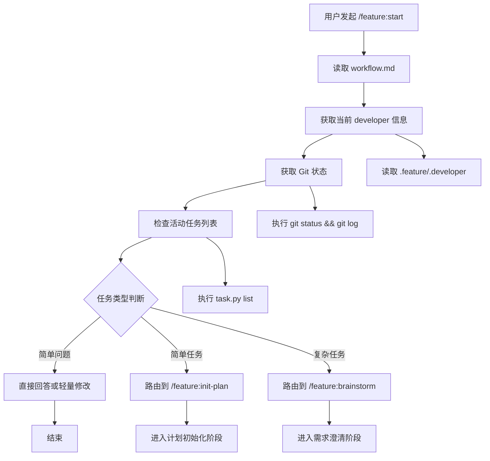

**输入输出**：
- 输入：用户需求描述
- 输出：任务类型判断，以及下一条需要手动运行的命令
- 状态更新：无强制文件写入；任务文件通常在后续 `/feature:init-plan` 或 `/feature:brainstorm` 中创建/更新

---

#### 3.2.2 `/feature:brainstorm` - 需求澄清

**作用**：对复杂任务进行需求澄清，生成 PRD 文档，对比多个方案，识别风险。

**影响的文件**：
- 创建：`.feature/tasks/<task>/prd.md`
- 更新：`.feature/tasks/<task>/task.json`

**执行流程**：

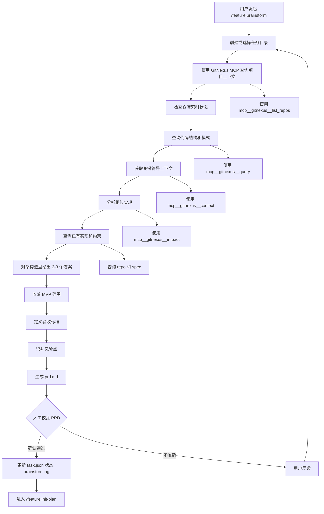

**输入输出**：
- 输入：需求描述、项目上下文
- 输出：`prd.md` 文件
- 状态更新：`task.json` 中 `status: "brainstorming"`, `artifacts: ["prd.md"]`

---

#### 3.2.3 `/feature:init-plan` - 初始化计划文件

**作用**：作为轻量任务的工作流入口，创建或恢复任务目录、最小 PRD 和三文件工作记忆。

**影响的文件**：
- 创建或补齐：
  - `.feature/tasks/<task>/task.json`
  - `.feature/tasks/<task>/prd.md`
  - `.feature/tasks/<task>/task_plan.md`
  - `.feature/tasks/<task>/findings.md`
  - `.feature/tasks/<task>/progress.md`
- 更新：`.feature/tasks/<task>/task.json`

**执行流程**：

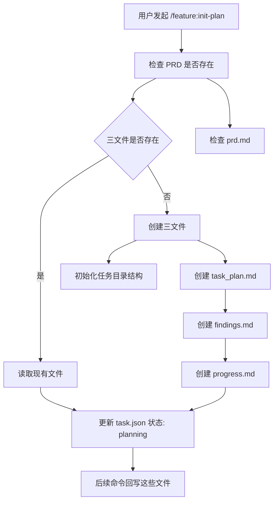

**输入输出**：
- 输入：已确认的任务目标，或已有 `prd.md`
- 输出：`prd.md`, `task_plan.md`, `findings.md`, `progress.md`
- 状态更新：`task.json` 中 `status: "planning"`, `artifacts: [..., "task_plan.md", "findings.md", "progress.md"]`

---

#### 3.2.4 `/feature:research` - 代码研究

**作用**：在编写实施计划前进行代码库调研，建立代码事实基线。

**影响的文件**：
- 读取：`prd.md`, 代码库
- 更新：`findings.md`, `prd.md`, `task_plan.md`
- 更新：`.feature/tasks/<task>/task.json`

**执行流程**：

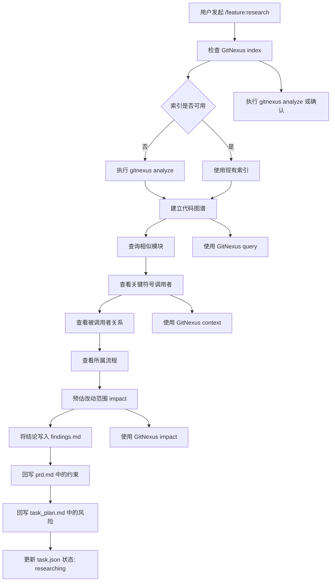

**输入输出**：
- 输入：`prd.md`, 代码库
- 输出：更新的 `findings.md`
- 状态更新：`task.json` 中 `status: "researching"`, `researchCompleted: true`

---

#### 3.2.5 `/feature:before-dev` - 开发准备

**作用**：读取相关规范，统一可执行上下文，确保开发准备就绪。

**影响的文件**：
- 读取：
  - `.feature/spec/<package>/<layer>/index.md`
  - `.feature/spec/guides/index.md`
  - `task_plan.md`, `findings.md`
- 更新：`.feature/tasks/<task>/task.json`

**执行流程**：

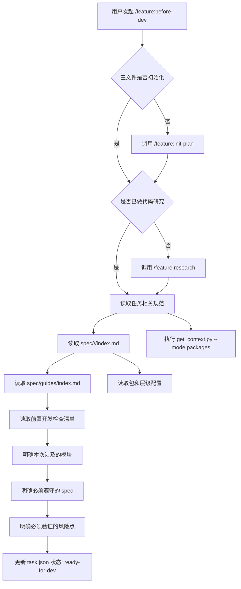

**输入输出**：
- 输入：`task_plan.md`, spec 文件
- 输出：开发上下文就绪状态
- 状态更新：`task.json` 中 `status: "ready-for-dev"`, `specLoaded: true`

---

#### 3.2.6 `/feature:write-plan` - 编写实施计划

**作用**：生成可执行的实施计划，按任务拆分到文件级别。

**影响的文件**：
- 读取：`prd.md`, `findings.md`, spec
- 创建：`.feature/tasks/<task>/implementation-plan.md`
- 更新：`.feature/tasks/<task>/task.json`

**执行流程**：

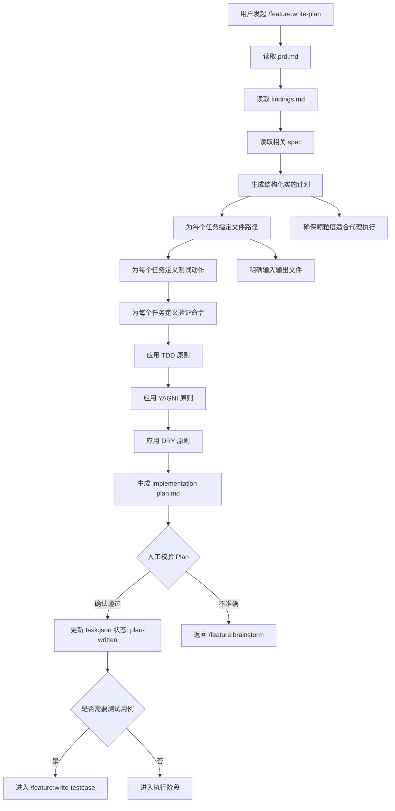

**输入输出**：
- 输入：`prd.md`, `findings.md`, spec
- 输出：`implementation-plan.md` 文件
- 状态更新：`task.json` 中 `status: "plan-written"`, `artifacts: [..., "implementation-plan.md"]`

---

#### 3.2.6.1 `/feature:write-testcase` - 生成测试用例（复杂任务必须）

**作用**：基于任务文档生成标准化的功能测试用例，支持测试驱动开发。复杂任务必须执行此步骤。

**影响的文件**：
- 读取：`prd.md`, `task_plan.md`, `findings.md`, `implementation-plan.md`, `_shared/testcase_spec.md`, `_shared/testcase_template.md`
- 创建：
  - `.feature/tasks/<task>/testcase_analysis.md` - 需求分析报告
  - `.feature/tasks/<task>/testcase.md` - 测试用例文档
- 更新：`.feature/tasks/<task>/task.json`

**执行流程**：

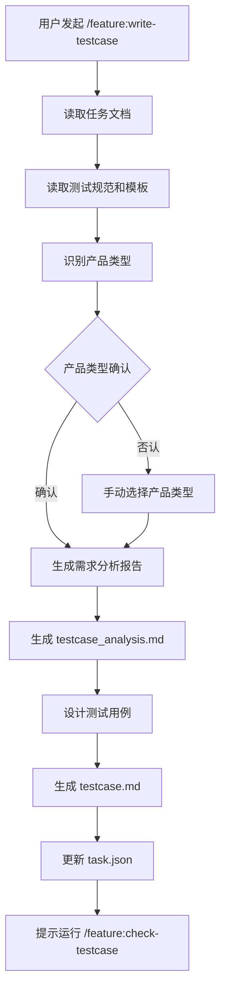

**输入输出**：
- 输入：任务文档、测试规范、模板
- 输出：`testcase_analysis.md`, `testcase.md`
- 状态更新：`task.json` 中 `testcaseGenerated: true`, `productType: "<类型>"`

**产品类型识别**：

| 产品类型 | 关键词 | Checklist 文件 |
|---------|--------|---------------|
| 屏控产品 | ADU/CDU/DMC/A9/DC1801/KVM | `testcase_checklist_PK.md` |
| 会议产品 | 会议平板/OPS/摄像头 | `testcase_checklist_HY.md` |
| 信发产品 | 信息发布平台/终端软件 | `testcase_checklist_XF.md` |

---

#### 3.2.6.2 `/feature:check-testcase` - 验证测试用例完整性（复杂任务必须）

**作用**：基于产品类型验证测试用例完整性，补充遗漏测试点，更新任务文档。复杂任务必须执行此步骤。

**影响的文件**：
- 读取：`testcase_analysis.md`, `testcase.md`, 产品 Checklist
- 创建：`.feature/tasks/<task>/testcase_checkdetail.md`
- 更新：
  - `testcase.md` - 补充遗漏用例
  - `prd.md` - 添加测试用例引用
  - `implementation-plan.md` - 添加测试执行阶段
  - `task_plan.md` - 更新阶段状态
  - `findings.md` - 添加测试发现
  - `progress.md` - 添加进度记录
  - `task.json` - 更新状态

**执行流程**：

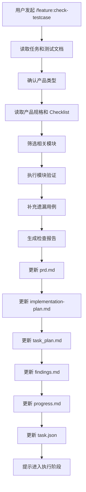

**输入输出**：
- 输入：测试用例文档、产品 Checklist
- 输出：`testcase_checkdetail.md`，更新的任务文档
- 状态更新：`task.json` 中 `testcaseVerified: true`, `testCoverageRate: "<%>"`

---

#### 3.2.7 `/feature:executing-plans` - 顺序执行计划

**作用**：在当前会话内按计划顺序推进，适合耦合较强的任务。

**影响的文件**：
- 读取：`implementation-plan.md`
- 更新：代码文件, `progress.md`, `task_plan.md`, `findings.md`
- 更新：`.feature/tasks/<task>/task.json`

**执行流程**：

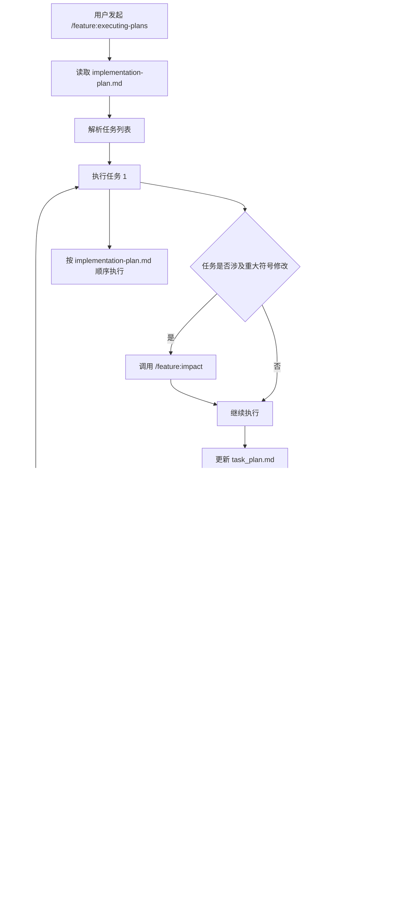

**输入输出**：
- 输入：`implementation-plan.md`
- 输出：代码修改, 更新的 `progress.md`
- 状态更新：`task.json` 中 `status: "executing"`, `executionMode: "inline"`

---

#### 3.2.8 `/feature:subagent-work` - 子代理执行

**作用**：使用独立子代理执行任务，适合独立性强、需长时间自治开发的任务。

**影响的文件**：
- 读取：`implementation-plan.md`
- 更新：代码文件, `progress.md`, `task_plan.md`
- 更新：`.feature/tasks/<task>/task.json`

**执行流程**：

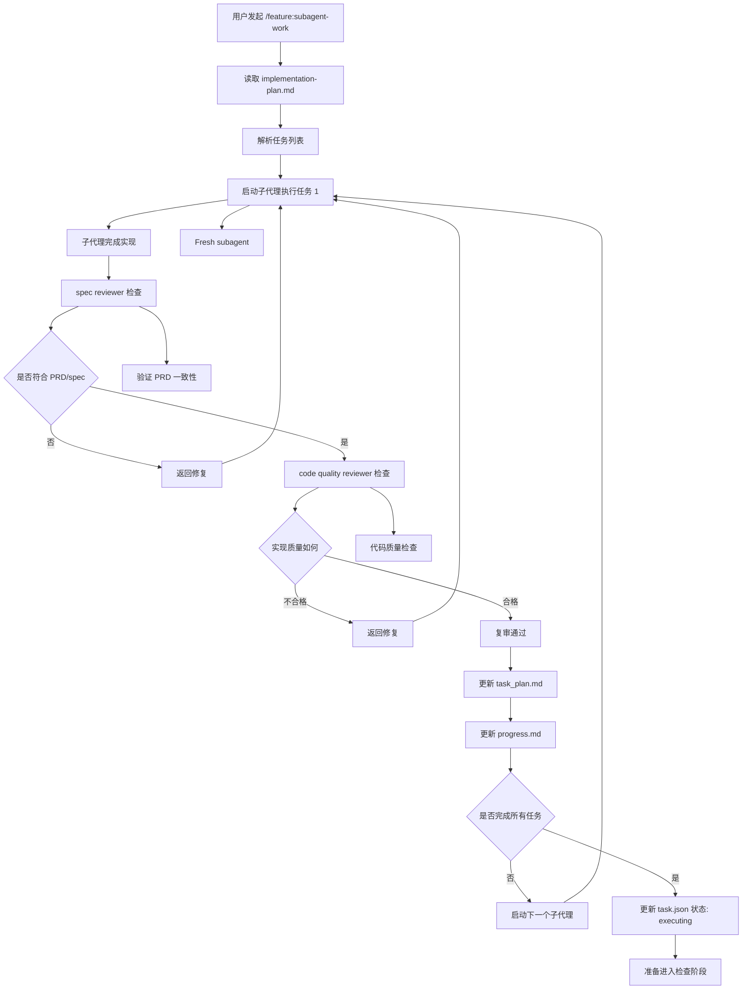

**输入输出**：
- 输入：`implementation-plan.md`
- 输出：代码修改, 更新的 `progress.md`
- 状态更新：`task.json` 中 `status: "executing"`, `executionMode: "subagent"`

---

#### 3.2.9 `/feature:impact` - 影响面分析

**作用**：在修改前评估影响范围，识别风险等级。

**影响的文件**：
- 读取：代码库, 目标符号
- 创建/更新：影响范围报告
- 更新：`.feature/tasks/<task>/task.json`

**执行流程**：

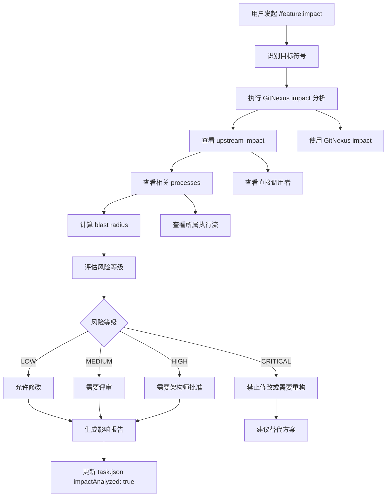

**输入输出**：
- 输入：变更目标符号
- 输出：影响范围报告
- 状态更新：`task.json` 中 `impactAnalyzed: true`, `impactReport: {...}`

---

#### 3.2.10 `/feature:check` - 开发自检

**作用**：进行轻量到中度的质量检查，面向开发中场景。

**影响的文件**：
- 读取：代码变更, spec 文件
- 更新：`.feature/tasks/<task>/task.json`

**执行流程**：

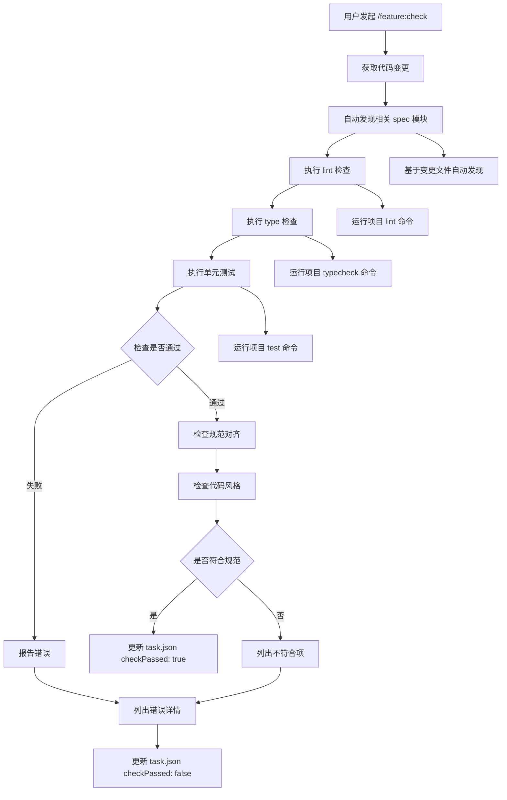

**输入输出**：
- 输入：代码变更
- 输出：检查结果
- 状态更新：`task.json` 中 `checkPassed: true/false`, `checkResults: [...]`

---

#### 3.2.11 `/feature:review` - 正式评审

**作用**：进行多角色正式评审，包括正确性、可维护性、安全性等多个维度。

**影响的文件**：
- 读取：代码变更, PRD, spec
- 创建：评审报告
- 更新：`.feature/tasks/<task>/task.json`

**执行流程**：

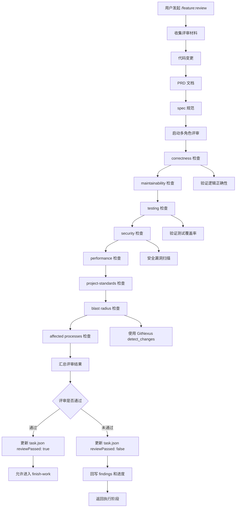

**输入输出**：
- 输入：代码变更, PRD, spec
- 输出：评审报告
- 状态更新：`task.json` 中 `reviewPassed: true/false`, `reviewResults: {...}`

---

#### 3.2.12 `/feature:finish-work` - 收尾工作

**作用**：汇总完成条件，校验所有交付物，准备提交。

**影响的文件**：
- 读取：所有工作产物
- 更新：`.feature/tasks/<task>/task.json`

**执行流程**：

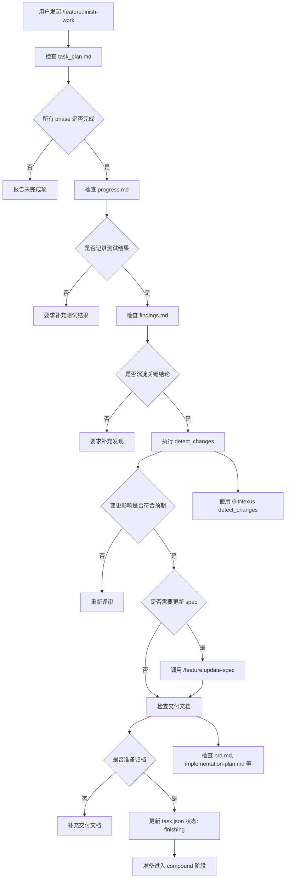

**输入输出**：
- 输入：所有工作产物
- 输出：完成状态确认
- 状态更新：`task.json` 中 `status: "finishing"`, `deliverables: [...]`

---

#### 3.2.13 `/feature:compound` - 经验沉淀

**作用**：复盘本轮工作，将解决方案文档化，沉淀到项目知识库。

**影响的文件**：
- 创建：`.feature/solutions/<category>/<filename>.md`（结构化解决方案文档）
- 可选更新：
  - `.feature/spec/`（当解决方案揭示可复用规则时）
  - `.feature/tasks/<task>/findings.md`（记录任务级决策理由）
- 更新：`.feature/tasks/<task>/task.json`

**执行流程**：

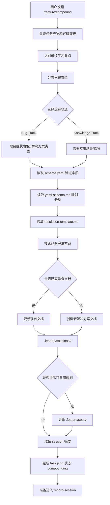

**输入输出**：
- 输入：`prd.md`, `task_plan.md`, `findings.md`, `progress.md`, 代码变更
- 输出：
  - `.feature/solutions/<category>/<filename>.md`（结构化解决方案文档，主要输出）
  - `.feature/spec/`（可选，当需要新增规则时）
  - `.feature/tasks/<task>/findings.md`（可选，记录任务级理由）
- 状态更新：`task.json` 中 `status: "compounding"`

**文档结构**：
- **Bug Track**（适用于 bug、错误、性能问题）：
  - Problem, Symptoms, What Didn't Work
  - Solution, Why This Works, Prevention
  - Related Issues

- **Knowledge Track**（适用于最佳实践、工作流、指导）：
  - Context, Guidance, Why This Matters
  - When to Apply, Examples, Related

---

#### 3.2.14 `/feature:record-session` - 记录会话

**作用**：记录会话内容和上下文，归档任务。

**影响的文件**：
- 创建/追加：`.feature/workspace/<developer>/journal-N.md`
- 移动：`.feature/tasks/<task>/` → `.feature/tasks/archive/<task>/`
- 更新：
  - `.feature/workspace/<developer>/index.md`
  - `.feature/tasks/<task>/task.json`

**执行流程**：

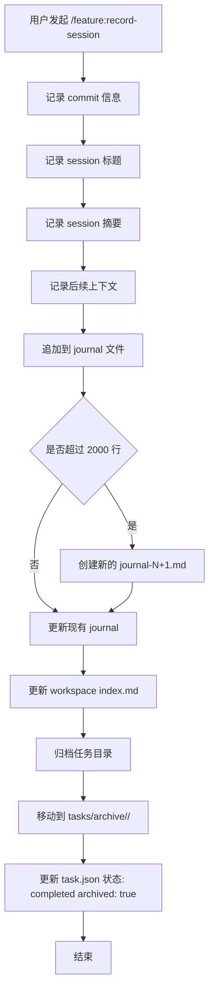

**输入输出**：
- 输入：会话记录（commit、标题、摘要、上下文）
- 输出：
  - `.feature/workspace/<developer>/journal-N.md`（追加会话记录）
  - `.feature/tasks/archive/<task>/`（归档的任务目录）
  - `.feature/workspace/<developer>/index.md`（更新会话计数）
- 状态更新：`task.json` 中 `status: "completed"`, `archived: true`

---

## 4. 任务处理流程

### 4.1 简单任务处理

**定义**：简单任务是指单一明确的需求，如添加小功能、修改配置、简单重构等，不需要复杂的架构设计和多轮迭代。

#### 4.1.1 处理流程

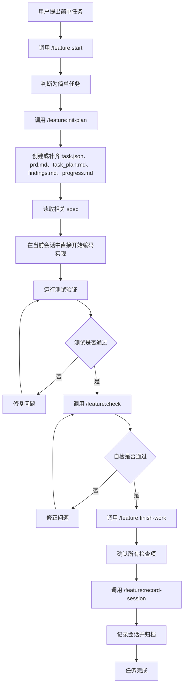

#### 4.1.2 输入输出文件

**输入文件**：
```
.feature/
├── spec/
│   └── <package>/
│       └── <layer>/
│           └── index.md          # 相关规范（必须读取）
└── workspace/
    └── <developer>/
        └── index.md              # 个人工作区索引
```

**过程文件**：
```
.feature/tasks/<MM-DD-simple-task>/
├── task.json                      # 任务状态跟踪
├── progress.md                    # 进度记录
├── task_plan.md                   # 任务计划（简单）
└── findings.md                    # 简要发现（可选）
```

**输出文件**：
```
.feature/
├── tasks/
│   └── archive/
│       └── <year-month>/
│           └── <MM-DD-simple-task>/
│               └── task.json      # 归档任务
└── workspace/
    └── <developer>/
        ├── index.md               # 更新索引
        └── journal-N.md           # 追加工作记录
```

#### 4.1.3 示例场景

**场景**：为项目添加一个简单的日志工具函数

**步骤**：
1. 运行 `/feature:start`，描述需求："添加日志工具函数"
2. Feature 判断为简单任务
3. 运行 `/feature:init-plan`，创建或恢复任务目录和基础文件（必要时补齐 `task.json`、`prd.md`、`progress.md`、`task_plan.md`、`findings.md`）
4. 读取 `spec/utils/index.md` 了解规范要求
5. **直接实施代码修改**：在 `src/utils/logger.ts` 添加日志函数
6. 编写单元测试
7. 运行测试验证功能
8. 运行 `/feature:check`，验证代码质量和规范对齐
9. 运行 `/feature:finish-work`，确认所有检查项通过
10. 运行 `/feature:record-session`，记录工作内容并归档任务

**关键说明**：
- 简单任务在 `init-plan` 后默认直接写代码，不需要默认执行 `/feature:write-plan`
- `/feature:init-plan` 负责兜住轻量流程入口：如果任务目录或 `prd.md` 不存在，应先补齐再进入编码
- 这里的“直接写代码”不是再运行一个新的 `/feature:*` 命令，而是在当前会话里继续实现任务
- 如果实现前还需要加载规范或注入上下文，可先运行 `/feature:before-dev`
- 如果任务范围扩大、实现路径不清晰，升级为 `/feature:research` -> `/feature:before-dev` -> `/feature:write-plan`

---

### 4.2 问题修复处理

**定义**：问题修复是指修复已发现的 bug、性能问题或安全漏洞，需要定位问题根因并进行针对性修复。

**分类判断**：
- **简单问题修复**：问题定位明确、修复范围小、不涉及架构变更（走简单任务流程）
- **复杂问题修复**：问题定位困难、修复范围大、涉及架构变更（走复杂任务流程）

**默认流程**：以下流程适用于大多数问题修复，根据实际情况简化或完整执行。

#### 4.2.1 处理流程

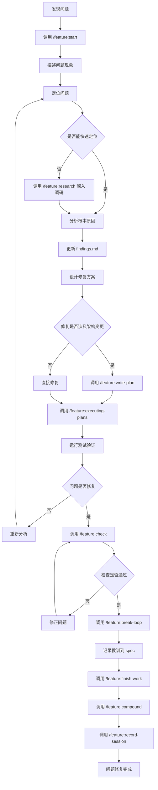

#### 4.2.2 输入输出文件

**输入文件**：
```
.feature/
├── spec/
│   └── <package>/
│       └── <layer>/
│           └── index.md          # 相关规范
└── workspace/
    └── <developer>/
        └── index.md              # 工作区索引
```

**过程文件**：
```
.feature/tasks/<MM-DD-bugfix-name>/
├── task.json                      # 任务状态
├── findings.md                    # 问题定位和分析
├── task_plan.md                   # 修复计划（复杂bug）
├── progress.md                    # 修复进度
└── prd.md                         # 问题详细描述（可选）
```

**输出文件**：
```
.feature/
├── solutions/
│   └── <category>/
│       └── <bugfix-slug>-YYYY-MM-DD.md  # 解决方案文档（主要）
├── spec/
│   └── <package>/
│       └── <layer>/
│           └── <topic>.md         # 更新或新增规范（可选）
├── tasks/
│   └── archive/
│       └── <year-month>/
│           └── <MM-DD-bugfix-name>/
│               ├── task.json      # 归档任务
│               └── findings.md    # 问题分析
└── workspace/
    └── <developer>/
        ├── index.md               # 更新索引
        └── journal-N.md           # 追加修复记录
```

#### 4.2.3 示例场景

**场景**：修复用户登录时的性能问题

**步骤**：
1. 运行 `/feature:start`，描述问题："用户登录响应时间超过5秒"
2. 运行 `/feature:research`，分析登录流程，定位性能瓶颈
3. 在 `findings.md` 记录：数据库查询缺少索引、N+1 查询问题
4. 设计修复方案：添加数据库索引、优化查询逻辑
5. 运行 `/feature:write-plan`，编写修复计划
6. 运行 `/feature:executing-plans`，实施修复
7. 运行测试验证，确认响应时间降到 500ms 以内
8. 运行 `/feature:check`，验证代码质量
9. 运行 `/feature:break-loop`，深度分析并记录到 spec
10. 运行 `/feature:compound`，沉淀经验到规范文档
11. 运行 `/feature:record-session`，归档任务

---

### 4.3 复杂问题处理

**定义**：复杂问题是指涉及多个模块、需要架构设计、多轮迭代的大型任务，如新功能开发、系统重构、跨模块改造等。

#### 4.3.1 处理流程

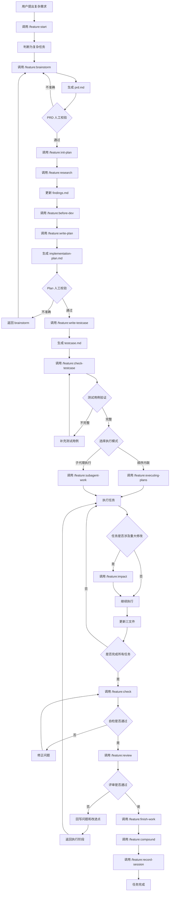

#### 4.3.2 输入输出文件

**输入文件**：
```
.feature/
├── spec/
│   ├── <package>/
│   │   └── <layer>/
│   │       └── index.md          # 包和层级规范
│   └── guides/
│       └── index.md              # 跨包思维指南
└── workspace/
    └── <developer>/
        └── index.md              # 工作区索引
```

**过程文件**：
```
.feature/tasks/<MM-DD-complex-feature>/
├── task.json                      # 任务状态和元数据
├── prd.md                         # 产品需求文档
├── task_plan.md                   # 任务计划（持久化记忆）
├── findings.md                    # 研究发现（持久化记忆）
├── progress.md                    # 进度记录（持久化记忆）
└── implementation-plan.md         # 实施计划（文件级拆分）
```

**输出文件**：
```
.feature/
├── spec/
│   ├── <package>/
│   │   └── <layer>/
│   │       ├── index.md           # 更新规范索引
│   │       └── <new-topic>.md     # 新增规范文档
│   └── guides/
│       └── <new-guide>.md         # 新增思维指南
├── tasks/
│   └── archive/
│       └── <year-month>/
│           └── <MM-DD-complex-feature>/
│               ├── task.json      # 归档任务
│               ├── prd.md         # 需求文档
│               ├── task_plan.md   # 任务计划
│               ├── findings.md    # 研究发现
│               ├── progress.md    # 进度记录
│               ├── implementation-plan.md  # 实施计划
│               └── findings.md    # 研究发现
└── workspace/
    └── <developer>/
        ├── index.md               # 更新索引
        └── journal-N.md           # 追加工作记录
```

#### 4.3.3 示例场景

**场景**：实现一个完整的用户认证和授权系统

**步骤**：

**第一阶段：需求澄清**
1. 运行 `/feature:start`，描述需求："实现用户认证和授权系统"
2. 运行 `/feature:brainstorm`，进行需求澄清
   - 调研现有系统：查询相关代码、已有实现
   - 方案对比：JWT vs Session、OAuth2 vs 自定义
   - MVP 范围：登录、注册、权限检查、Token 刷新
   - 验收标准：功能完整、安全性高、性能达标
   - 风险识别：密码存储、Token 安全、并发控制
3. 生成 `prd.md`，等待人工校验
4. 用户确认 PRD 内容准确

**第二阶段：初始化和研究**
5. 运行 `/feature:init-plan`，创建三文件工作流
6. 运行 `/feature:research`，进行代码调研
   - 分析现有用户模型和数据库结构
   - 研究现有权限系统实现
   - 查找相关依赖和库
   - 评估技术选型（JWT 库、加密库等）
7. 更新 `findings.md`，记录研究结果

**第三阶段：计划**
8. 运行 `/feature:before-dev`，加载相关规范
   - 读取 `spec/backend/index.md`
   - 读取 `spec/frontend/index.md`
   - 读取 `spec/guides/security-guide.md`
9. 运行 `/feature:write-plan`，编写实施计划
   - 拆分为多个任务：数据库迁移、认证 API、前端登录页、权限中间件、测试
   - 每个任务指定文件路径、测试动作、验证命令
10. 生成 `implementation-plan.md`，等待人工校验
11. 用户确认计划内容准确

**第四阶段：测试用例生成（复杂任务必须）**
12. 运行 `/feature:write-testcase`，生成测试用例
    - 读取任务文档（prd.md, findings.md, implementation-plan.md）
    - 读取测试规范和模板（testcase_spec.md, testcase_template.md）
    - 识别产品类型：屏控产品/会议产品/信发产品
    - 生成需求分析报告 `testcase_analysis.md`
    - 设计测试用例：功能测试、组合测试、边界测试、异常测试等
    - 生成测试用例文档 `testcase.md`
13. 运行 `/feature:check-testcase`，验证测试用例完整性
    - 确认产品类型并加载对应 Checklist
    - 筛选相关模块
    - 执行模块验证，识别遗漏测试点
    - 补充遗漏的测试用例
    - 生成检查报告 `testcase_checkdetail.md`
    - 更新任务文档（prd.md, implementation-plan.md, task_plan.md, findings.md, progress.md）

**第五阶段：实施**
14. 选择执行模式：子代理执行（任务独立性强）
15. 运行 `/feature:subagent-work`
    - 子代理 1：实现数据库迁移和用户模型
    - Spec reviewer 检查：验证符合数据建模规范
    - Code quality reviewer 检查：验证代码质量
    - 子代理 2：实现认证 API（登录、注册、Token 刷新）
    - 子代理 3：实现前端登录页面
    - 子代理 4：实现权限中间件
    - 子代理 5：编写集成测试
16. 在关键修改前运行 `/feature:impact`，评估影响
17. 持续更新 `progress.md`、`task_plan.md`、`findings.md`

**第六阶段：检查和评审**
18. 运行 `/feature:check`，进行自检
    - Lint 检查通过
    - Type 检查通过
    - 单元测试通过
19. 运行 `/feature:review`，进行正式评审
    - Correctness：逻辑正确性验证
    - Security：安全漏洞扫描（密码哈希、Token 安全）
    - Testing：测试覆盖率检查
    - Performance：性能测试（登录接口响应时间）
    - Project standards：规范对齐检查
20. 评审通过

**第七阶段：收尾和沉淀**
21. 运行 `/feature:finish-work`
    - 确认所有功能完成
    - 确认测试覆盖完整
    - 确认文档更新（API 文档、部署文档）
22. 运行 `/feature:compound`，创建解决方案文档
    - 创建 `.feature/solutions/security/auth-system-2026-04-06.md`
    - 记录认证系统实现方案、安全考虑、最佳实践
    - 更新 `spec/backend/auth-guide.md`：认证最佳实践
    - 更新 `spec/guides/security-guide.md`：密码存储规范
23. 运行 `/feature:record-session`，归档任务
    - 移动任务到 `tasks/archive/`
    - 更新工作区索引
    - 追加工作记录到 `journal-N.md`

**涉及的关键文件**：

```
输入文件：
├── spec/backend/index.md
├── spec/frontend/index.md
├── spec/guides/security-guide.md
└── workspace/<developer>/index.md

过程文件：
├── tasks/04-06-user-auth-system/
│   ├── task.json
│   ├── prd.md
│   ├── task_plan.md
│   ├── findings.md
│   ├── progress.md
│   ├── implementation-plan.md
│   ├── testcase_analysis.md          # 需求分析报告
│   ├── testcase.md                   # 测试用例文档
│   └── testcase_checkdetail.md       # 测试用例检查报告

输出文件：
├── solutions/security/auth-system-2026-04-06.md  # 解决方案文档（新增）
├── spec/backend/auth-guide.md (新增)
├── spec/guides/security-guide.md (更新)
├── tasks/archive/2026-04/04-06-user-auth-system/
│   ├── task.json
│   ├── prd.md
│   ├── task_plan.md
│   ├── findings.md
│   ├── progress.md
│   ├── implementation-plan.md
│   ├── testcase_analysis.md
│   ├── testcase.md
│   └── testcase_checkdetail.md
└── workspace/<developer>/journal-N.md (追加)
```

---

## 附录

### A. 命令快速参考表

| 命令                         | 阶段   | 主要作用                 | 关键输出文件                                                 |
| -------------------------- | ---- | -------------------- | ------------------------------------------------------ |
| `/feature:start`           | 启动   | 初始化会话，判断任务类型并给出下一条命令 | 任务分类结果                                                 |
| `/feature:brainstorm`      | 澄清   | 需求澄清，生成 PRD          | `prd.md`                                               |
| `/feature:init-plan`       | 初始化  | 创建或恢复轻量任务入口所需文件      | `prd.md`, `task_plan.md`, `findings.md`, `progress.md` |
| `/feature:research`        | 研究   | 代码调研，建立事实基线          | `findings.md` (更新)                                     |
| `/feature:before-dev`      | 准备   | 加载规范，准备开发            | 上下文就绪状态                                                |
| `/feature:write-plan`      | 计划   | 生成实施计划               | `implementation-plan.md`                               |
| `/feature:write-testcase`  | 测试用例 | 生成功能测试用例（复杂任务必须）     | `testcase_analysis.md`, `testcase.md`                  |
| `/feature:check-testcase`  | 测试验证 | 验证测试用例完整性（复杂任务必须）    | `testcase_checkdetail.md`                              |
| `/feature:executing-plans` | 执行   | 顺序执行计划               | 代码, `progress.md`                                      |
| `/feature:subagent-work`   | 执行   | 子代理执行任务              | 代码, `progress.md`                                      |
| `/feature:impact`          | 分析   | 影响面分析                | 影响报告                                                   |
| `/feature:check`           | 自检   | 开发中质量检查              | 检查结果                                                   |
| `/feature:review`          | 评审   | 正式多角色评审              | 评审报告                                                   |
| `/feature:finish-work`     | 收尾   | 汇总完成条件               | 完成确认                                                   |
| `/feature:compound`        | 沉淀   | 创建结构化解决方案文档          | `solutions/<category>/<filename>.md`                   |
| `/feature:record-session`  | 归档   | 记录会话，归档任务            | `journal-N.md`, 归档目录                                   |

### B. 任务状态流转图

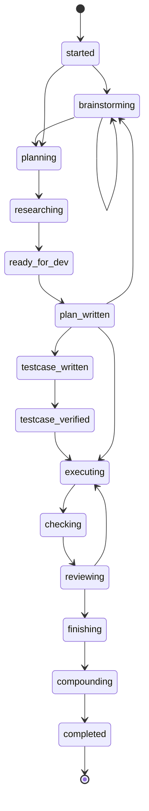

### C. 常见问题

**Q1: 如何判断任务是简单、问题修复还是复杂？**

A: Feature 会在 `/feature:start` 阶段根据以下标准判断：
- **简单任务**：单一明确需求，不涉及架构变更，可直接实施
- **问题修复**：修复已存在的问题，需要定位和分析根因
- **复杂任务**：涉及多模块、需要架构设计、多轮迭代的大型任务

**Q2: 三文件工作流是什么？**

A: 三文件是指 `task_plan.md`、`findings.md` 和 `progress.md`，用于持久化执行态工作记忆：
- `task_plan.md`：任务计划，记录当前执行阶段和待办事项
- `findings.md`：研究发现，记录代码调研结论和关键发现
- `progress.md`：进度记录，记录测试结果和行为日志

**Q3: 什么时候需要运行 `/feature:impact`？**

A: 建议在以下情况运行：
- 修改公共函数、类或方法前
- 修改核心模块或基础组件前
- 重构关键业务逻辑前
- 提交代码前进行最终检查

**Q4: `/feature:check` 和 `/feature:review` 有什么区别？**

A: 
- `/feature:check`：轻量自检，面向开发中场景，快速验证代码质量
- `/feature:review`：正式评审，多角色、多维度深度检查，面向提交前场景

**Q5: 如何恢复中断的任务？**

A: 运行 `/feature:resume-plan` 命令，它会：
1. 读取 `task_plan.md` 确认当前阶段
2. 读取 `findings.md` 恢复研究发现
3. 读取 `progress.md` 了解进度
4. 检查 git diff 查看已修改内容
5. 继续执行下一条命令

---

**文档版本**：v1.0  
**最后更新**：2026-04-06  
**维护者**：Feature 项目团队
